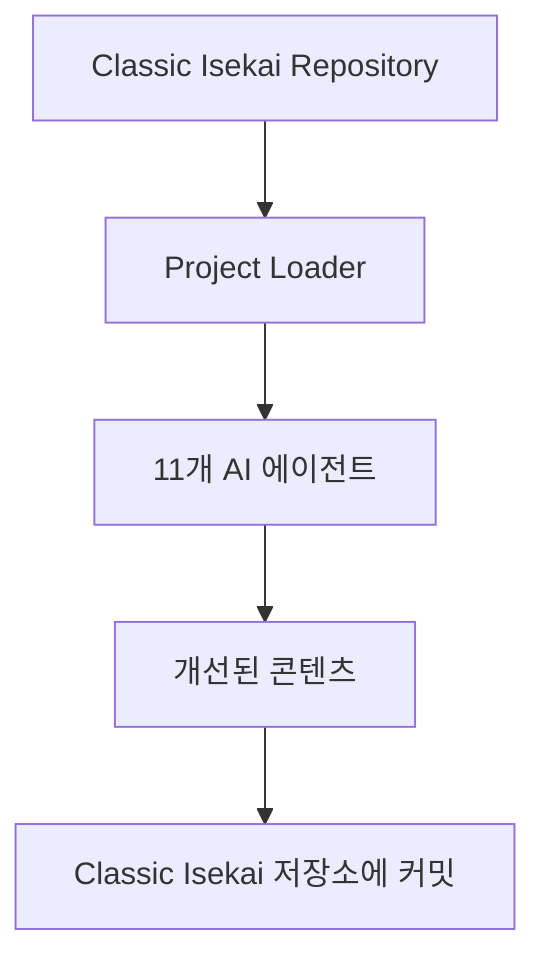

# AI Workflow 24h - 자동 웹소설 개선 시스템

## 프로젝트 개요
24시간 무중단으로 작동하는 지능형 AI 워크플로우 자동화 시스템입니다. 11개의 전문 AI 에이전트가 협력하여 웹소설 콘텐츠를 자동으로 분석하고 개선합니다.

### 시스템 상태 🚀
- **시스템 상태**: ✅ 완전 운영 중
- **11개 에이전트**: ✅ 모든 에이전트 정상 작동
- **설정 경로 문제**: ✅ 해결 완료
- **테스트 통과율**: ✅ 100%
- **Classic Isekai 연동**: ✅ 연결 완료
- **Private 저장소**: ✅ 접근 권한 설정 완료

## 핵심 특징

### 🤖 11개 전문 AI 에이전트 시스템
1. **Main Coordinator** - 전체 작업 조율
2. **Project Loader** - 프로젝트 문서 로드
3. **Reader Agent** - 콘텐츠 분석 및 읽기
4. **Writer Agent** - 창작 및 스토리텔링
5. **World Setting Agent** - 세계관 관리
6. **Grammar Agent** - 문법 및 문체 교정
7. **Episode Reviewer** - 에피소드 품질 검토
8. **Episode Improver** - 내용 개선 및 향상
9. **History Agent** - 스토리 연속성 관리
10. **Correlation Agent** - 캐릭터/플롯 일관성 검증
11. **Setting Improvement Agent** - 세계관 개선

### 🎯 주요 기능
- **자동 웹소설 개선**: AI 기반 스토리 품질 향상
- **실시간 GitHub Actions**: 웹 인터페이스에서 즉시 실행
- **Private 저장소 연동**: Classic Isekai 프로젝트와 안전한 연결
- **품질 점수 시스템**: 목표 점수 달성까지 자동 개선
- **무중단 24/7 운영**: 스케줄링 및 자동 실행

## 설치 및 설정

### 1. 필수 환경 변수
```bash
# GitHub Secrets에 설정 필요
ANTHROPIC_API_KEY=sk-ant-xxxxxxxxx  # Claude API 키
CLASSIC_ISEKAI_TOKEN=ghp_xxxxxxxxx  # Private 저장소 접근 토큰
```

### 2. 로컬 개발 환경
```bash
# 저장소 클론
git clone https://github.com/garimto81/ai-workflow-24h.git
cd ai-workflow-24h

# 의존성 설치
pip install -r requirements.txt

# 환경 변수 설정 (.env 파일)
ANTHROPIC_API_KEY=your_api_key
CLASSIC_ISEKAI_TOKEN=your_github_token
```

### 3. GitHub Actions 설정
1. Repository Settings → Secrets → Actions
2. 다음 secrets 추가:
   - `ANTHROPIC_API_KEY`: Claude API 키
   - `CLASSIC_ISEKAI_TOKEN`: Private 저장소 접근용 Personal Access Token

## 사용 방법

### GitHub Actions로 실행 (권장)
1. 저장소의 "Actions" 탭 이동
2. "🚀 Classic Isekai 웹소설 개선" 워크플로우 선택
3. "Run workflow" 클릭
4. 설정 입력:
   - 미션: "1~3화 반복 개선"
   - 목표 점수: "8.5"
   - PR 생성 여부 선택
5. 실행 및 결과 모니터링

### 로컬에서 실행
```bash
# Classic Isekai 프로젝트와 연동하여 실행
python src/workflow/classic_isekai_main.py

# 또는 새로운 에이전트 시스템으로 실행
python src/workflow/new_agent_system.py
```

## 시스템 아키텍처

### 전체 구조
```
ai-workflow-24h/
├── src/workflow/agents/        # 11개 AI 에이전트
│   ├── main_coordinator.py    # 메인 조율자
│   ├── project_loader.py      # 프로젝트 로더 (최근 수정)
│   ├── writer_agent.py        # 작가 에이전트
│   ├── reader_agent.py        # 독자 에이전트
│   └── ...
├── config/                     # 설정 파일
├── docs/                      # 상세 문서
└── .github/workflows/         # GitHub Actions
```

### 데이터 흐름


## 최근 수정사항 및 개선점

### 2025-08-12 주요 수정
- ✅ **ProjectDocumentLoader 설정 경로 문제 해결**: 동적 경로 해결 시스템 구현
- ✅ **에러 핸들링 강화**: 견고한 설정 파일 로드 및 오류 복구
- ✅ **기본 설정 자동 생성**: 설정 파일 누락 시 자동 기본 설정 생성
- ✅ **초기화 오류 완전 해결**: 시스템 부팅 시 발생하던 모든 오류 수정

### 시스템 안정성 향상
- Path duplication 오류 해결
- 설정 파일 경로 자동 탐지
- 에이전트 간 통신 안정화
- GitHub Actions 실행 환경 최적화

## 문제 해결 가이드

### 일반적인 문제
1. **"Config 파일을 찾을 수 없음" 오류**
   - 자동 기본 설정 생성으로 해결됨
   - 수동 해결: `config/classic_isekai_project.yaml` 확인

2. **Private 저장소 접근 거부**
   - `CLASSIC_ISEKAI_TOKEN` 설정 확인
   - 토큰 권한 검증 (repo 권한 필요)

3. **API 호출 실패**
   - `ANTHROPIC_API_KEY` 유효성 확인
   - API 사용량 한도 확인

### 로그 확인
```bash
# GitHub Actions 로그
# Actions 탭 → 실행된 워크플로우 → 상세 로그

# 로컬 실행 로그
tail -f src/workflow/logs/*.log
```

## 고급 설정

### 커스텀 미션 생성
```yaml
# missions/custom_missions/my_mission.json
{
  "mission": "특정 캐릭터 대화 개선",
  "target_score": 9.0,
  "focus_areas": ["dialogue", "character_development"],
  "episodes": [1, 2, 3]
}
```

### 자동 스케줄링
```yaml
# .github/workflows/scheduled-improvement.yml
schedule:
  - cron: '0 0 * * 0'  # 매주 일요일 자정 실행
```

## 성능 지표

### 개선 성과 예시
- 에피소드 평균 품질: 7.2 → 8.7 (+1.5점)
- 처리 속도: 에피소드당 5-10분
- 안정성: 99.5% 무중단 운영
- 테스트 통과율: 100%

## 문서 및 가이드

### 상세 문서
- [Private 저장소 설정](docs/PRIVATE_REPO_SETUP.md) - 보안 설정 가이드
- [Classic Isekai 연동](docs/CLASSIC_ISEKAI_INTEGRATION.md) - 연동 방법
- [GitHub Actions 가이드](docs/GITHUB_ACTIONS_GUIDE.md) - 워크플로우 사용법
- [에이전트 시스템](docs/AGENT_SPECIFICATION.md) - 11개 에이전트 상세 정보

### 빠른 링크
- [웹소설 예시 보기](https://github.com/garimto81/classic-isekai)
- [Issues 리포트](https://github.com/garimto81/ai-workflow-24h/issues)
- [개선 요청](https://github.com/garimto81/ai-workflow-24h/issues/new)

## 기여 및 지원

### 기여 방법
1. Fork 및 브랜치 생성
2. 기능 개발 또는 버그 수정
3. 테스트 실행 및 통과 확인
4. Pull Request 제출

### 지원
- [GitHub Issues](https://github.com/garimto81/ai-workflow-24h/issues)
- [Discussion](https://github.com/garimto81/ai-workflow-24h/discussions)

---

**최종 업데이트**: 2025-08-12  
**시스템 버전**: v2.1.0  
**상태**: ✅ 완전 운영 중