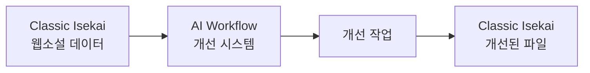

# 🔗 Classic Isekai 저장소 연동 가이드

## 📚 개요

이 시스템은 두 저장소를 연동합니다:
1. **ai-workflow-24h**: AI 개선 시스템 (현재 저장소)
2. **classic-isekai**: 실제 웹소설 데이터

## 🎯 작동 방식



### 데이터 흐름
1. **Classic Isekai**에서 원본 에피소드 읽기
2. **AI Workflow**에서 개선 작업 수행
3. 개선된 내용을 **Classic Isekai**에 저장
4. 자동 커밋 또는 Pull Request 생성

## 🚀 사용 방법

### 1. GitHub Actions에서 실행
```
1. Actions → "🚀 Classic Isekai 웹소설 개선"
2. Run workflow
3. 설정:
   - 미션: "1~3화 반복 개선"
   - 목표 점수: "8.5"
   - PR 생성: "false" (직접 커밋) 또는 "true" (PR 생성)
4. Run workflow 클릭
```

### 2. 자동 검증 프로세스
시스템이 자동으로 수행:
- ✅ 에피소드 파일 존재 확인
- ✅ 파일 구조 검증
- ✅ 세계관 용어 일관성 체크
- ✅ 캐릭터 이름 확인

## 📁 Classic Isekai 저장소 구조

```
classic-isekai/
├── webnovel_episodes/        # 실제 에피소드 파일들
│   ├── 001_에피소드_1화.md
│   ├── 002_에피소드_2화.md
│   └── 003_에피소드_3화.md
├── world_setting/            # 세계관 설정
│   ├── 000_INDEX.md
│   ├── 021_resonance_system.md
│   └── 100_protagonist.md
├── docs/                     # 가이드 문서
└── PROJECT_OVERVIEW.md      # 프로젝트 개요
```

## 🔍 검증 항목

### 에피소드 검증
- **길이**: 5,000 ~ 10,000자
- **구조**: 제목, 본문 구분
- **세계관**: 핵심 용어 포함 (공명력, Resonance)
- **캐릭터**: 주인공 이름 확인 (카이)

### 프로젝트 문서 검증
- README.md
- PROJECT_OVERVIEW.md
- WORLDBUILDING_RULES.md
- 세계관 설정 문서들

## 🤖 자동 개선 프로세스

### 1단계: 데이터 로드
```python
# Classic Isekai에서 에피소드 가져오기
connector = ClassicIsekaiConnector()
content = await connector.fetch_episode_content(1)
docs = await connector.fetch_project_documents()
```

### 2단계: 검증
```python
# 에피소드 유효성 검사
validator = EpisodeValidator(connector)
validation = await validator.validate_episode(1)
```

### 3단계: 개선
```python
# 11개 에이전트로 개선
system = NewAgentSystem()
result = await system.coordinate_episode_improvement(task)
```

### 4단계: 저장
```python
# 개선된 내용 저장 및 커밋
await connector.save_improved_episode(
    episode_number=1,
    improved_content=result['content'],
    commit_message="🤖 AI 개선: 1화"
)
```

## 📊 개선 결과 예시

### Before (원본)
```markdown
제1화: 각성

카이는 눈을 떴다. 낯선 천장이 보였다...
[기본적인 서술]
```

### After (개선 후)
```markdown
제1화: 공명의 시작

차가운 공기가 폐를 채웠다. 카이는 천천히 눈을 떜으며 
주변을 살폈다. 붕괴된 건물의 잔해 사이로 희미한 푸른빛이 
맥동했다 - 공명력(Resonance)의 흔적이었다...
[향상된 묘사와 세계관 반영]
```

## ⚙️ 설정 옵션

### Pull Request 모드
```yaml
create_pr: true
# 브랜치 생성 → 커밋 → PR 생성
# 검토 후 머지 가능
```

### 직접 커밋 모드
```yaml
create_pr: false
# master 브랜치에 직접 커밋
# 즉시 반영
```

## 🔐 권한 설정

### 필요한 권한
1. **classic-isekai** 저장소 쓰기 권한
2. **GITHUB_TOKEN** 설정
3. **ANTHROPIC_API_KEY** 설정

### Token 설정 방법
```
1. Settings → Secrets → Actions
2. New repository secret
3. Name: ANTHROPIC_API_KEY
4. Value: [API 키]
```

## 📈 모니터링

### 실행 상태 확인
- Actions 탭에서 실행 로그 확인
- Summary에서 개선 결과 요약
- Classic Isekai 저장소에서 커밋 확인

### 개선 통계
```
에피소드 1화: 7.5 → 8.7 (+1.2)
에피소드 2화: 7.2 → 8.5 (+1.3)
에피소드 3화: 7.8 → 8.9 (+1.1)
평균 향상: +1.2점
```

## 🚨 문제 해결

### 에피소드를 찾을 수 없음
- 파일명 형식 확인: `XXX_에피소드_X화.md`
- 경로 확인: `webnovel_episodes/` 폴더

### 커밋 실패
- 저장소 권한 확인
- GitHub Token 유효성 확인

### 개선 효과 미미
- 목표 점수 상향
- 특정 영역 집중 (액션, 캐릭터 등)
- 사이클 수 증가

## 📝 커스텀 설정

### 특정 영역 집중
```
미션: "1화 액션씬 강화"
미션: "2화 캐릭터 대화 개선"
미션: "3화 세계관 묘사 강화"
```

### 전체 개선
```
미션: "1~3화 전반적 품질 향상"
목표: "9.0"
```

## 🔄 자동 실행

### 매주 일요일 자동 실행
```yaml
schedule:
  - cron: '0 0 * * 0'  # 매주 일요일 자정
```

### Issue 트리거
Classic Isekai 저장소에서:
```markdown
제목: [improve] 1화 개선 요청
내용: 액션씬을 더 역동적으로
라벨: enhancement
```

## 📞 지원

문제 발생 시:
1. [AI Workflow Issues](https://github.com/garimto81/ai-workflow-24h/issues)
2. [Classic Isekai Issues](https://github.com/garimto81/classic-isekai/issues)