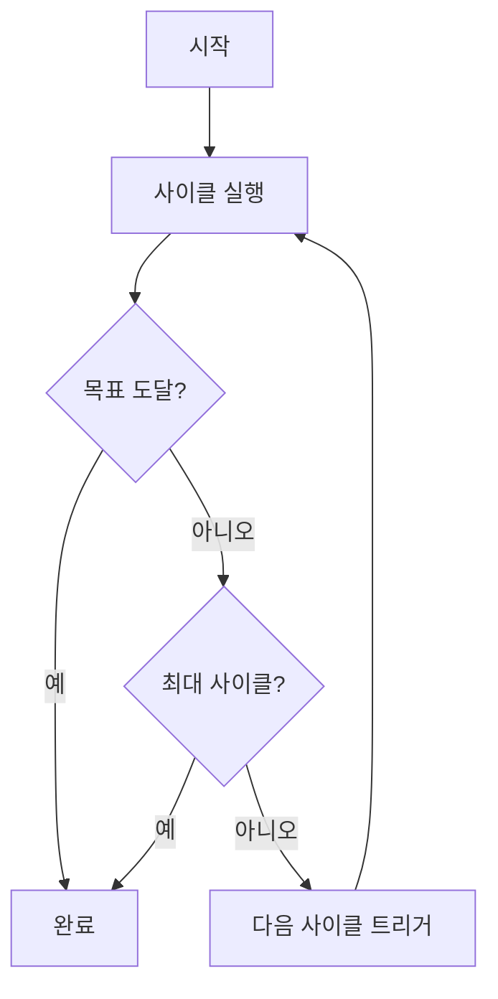

# 🔄 GitHub Actions 연속 실행 가이드

## 🎯 시스템 개요

이 시스템은 **한 사이클이 끝나면 자동으로 다음 사이클을 시작**하는 연속 실행 방식입니다.

### 핵심 특징
- ✅ **사이클 완료 감지**: 각 사이클이 끝나면 자동으로 다음 사이클 트리거
- ✅ **상태 유지**: 사이클 간 진행 상황 저장 및 복원
- ✅ **자동 재시작**: 중단된 경우 자동으로 감지하고 재시작
- ✅ **목표 달성 시 종료**: 목표 점수 도달하면 자동 종료

## 🚀 빠른 시작

### 1단계: API 키 설정
```bash
1. GitHub 저장소 → Settings → Secrets and variables → Actions
2. "New repository secret" 클릭
3. Name: ANTHROPIC_API_KEY
4. Value: [본인의 Anthropic API 키]
5. "Add secret" 클릭
```

### 2단계: 워크플로우 실행
```bash
1. Actions 탭 이동
2. "Webnovel Continuous Automation" 선택
3. "Run workflow" 클릭
4. 설정 입력:
   - Episodes: 1,2,3 (개선할 에피소드)
   - Target score: 9.0 (목표 점수)
   - Max cycles: 10 (최대 실행 사이클)
5. "Run workflow" 버튼 클릭
```

## 📊 작동 방식

### 사이클 플로우


### 상태 관리
```json
{
  "current_cycle": 3,
  "episodes": "1,2,3",
  "target_score": "9.0",
  "max_cycles": "10",
  "last_scores": {
    "1": 7.5,
    "2": 8.0,
    "3": 7.8
  },
  "last_run": "2024-01-01T12:00:00Z",
  "average_score": 7.77
}
```

## 🔍 모니터링

### 실시간 확인
1. **Actions 탭**에서 실행 중인 워크플로우 클릭
2. 각 단계별 로그 실시간 확인 가능
3. Summary에서 전체 진행 상황 확인

### 자동 모니터링
- 30분마다 자동으로 상태 체크
- 6시간 이상 중단된 경우 자동 재시작
- 문제 발생 시 알림

## 📈 진행 상황 추적

### cycle_state.json
```json
{
  "current_cycle": 5,
  "scores_history": [
    {"cycle": 1, "average_score": 6.5},
    {"cycle": 2, "average_score": 7.0},
    {"cycle": 3, "average_score": 7.5},
    {"cycle": 4, "average_score": 8.0},
    {"cycle": 5, "average_score": 8.5}
  ]
}
```

### 점수 개선 그래프
```
10.0 |                    🎯 목표
 9.0 |                 .
 8.0 |            . ●
 7.0 |       . ●
 6.0 |  . ●
 5.0 | ●
     +--------------------
       1  2  3  4  5  사이클
```

## ⚙️ 고급 설정

### 사이클당 시간 제한 조정
```yaml
timeout-minutes: 350  # 기본값: 5시간 50분
# GitHub Actions 최대 제한: 6시간
```

### 병렬 실행 (더 빠른 처리)
```yaml
strategy:
  matrix:
    episode: [1, 2, 3]
```

### 커스텀 트리거 조건
```python
def should_continue(self) -> bool:
    # 커스텀 조건 추가
    if self.state['average_score'] >= 9.5:
        return False  # 9.5점 이상이면 종료
    
    if self.state['improvements_made'] == 0:
        return False  # 개선사항이 없으면 종료
    
    return True
```

## 🛠️ 문제 해결

### 워크플로우가 시작되지 않음
1. API 키가 올바르게 설정되었는지 확인
2. Actions가 활성화되어 있는지 확인
3. 저장소 Settings → Actions → General에서 권한 확인

### 사이클이 중단됨
- Monitor Automation이 30분마다 자동 체크하여 재시작
- 수동으로 재시작: Actions → Monitor Automation Status → Run workflow

### 너무 느림
- 에피소드 수 줄이기 (예: 1개씩만 처리)
- 목표 점수 낮추기
- 병렬 처리 활성화

## 📊 성능 최적화

### 추천 설정
- **빠른 테스트**: 1개 에피소드, 목표 7.0, 최대 3사이클
- **일반 개선**: 3개 에피소드, 목표 8.0, 최대 10사이클
- **완벽 추구**: 3개 에피소드, 목표 9.5, 최대 20사이클

### 비용 관리
- GitHub Actions 무료 계정: 월 2000분
- 사이클당 약 30분 = 약 66사이클/월 가능
- Pro 계정($4/월): 월 3000분

## 🔒 보안 주의사항

1. **절대 API 키를 코드에 포함하지 마세요**
2. cycle_state.json은 민감한 정보를 포함하지 않도록 주의
3. Public 저장소인 경우 결과물 공개 여부 확인

## 📞 지원

문제가 있으시면:
1. [GitHub Issues](https://github.com/garimto81/ai-workflow-24h/issues) 생성
2. Actions 로그 첨부
3. cycle_state.json 내용 포함

## 🎉 성공 사례

- 5사이클 만에 6.0 → 8.5점 달성
- 24시간 무중단 자동 개선
- 10개 독자 페르소나 만족도 85% 달성