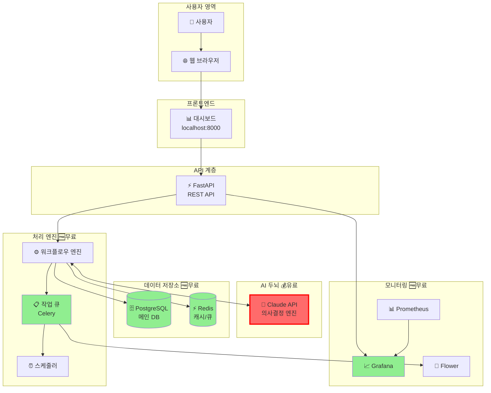
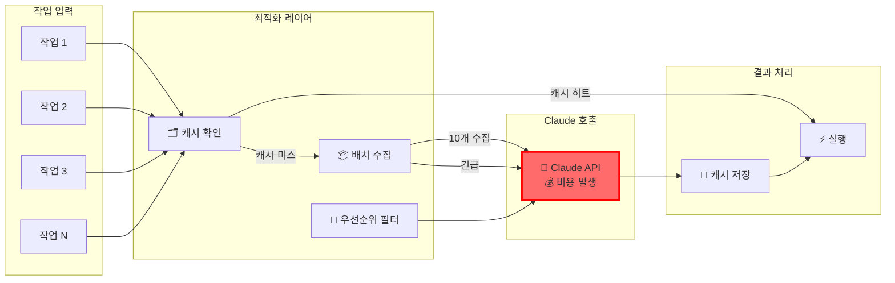
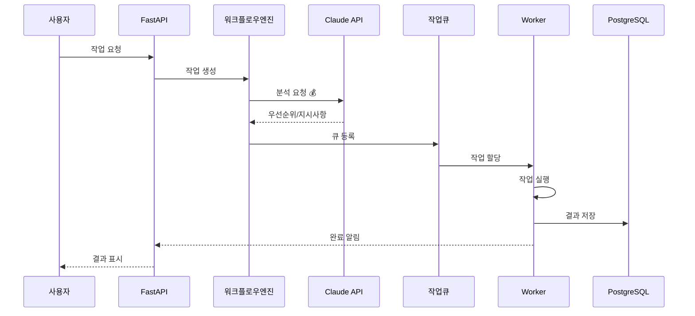
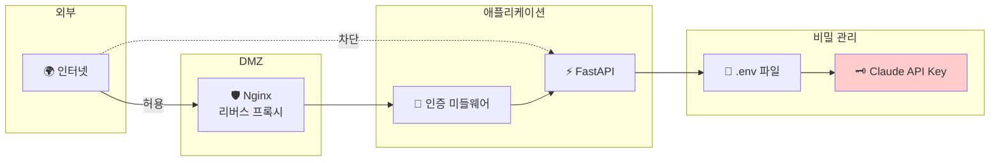

# 🎨 시스템 아키텍처 시각화

## 📐 전체 시스템 흐름도



## 🔄 작업 처리 생명주기

```mermaid
stateDiagram-v2
    [*] --> 작업생성: 사용자/시스템 요청
    
    작업생성 --> Claude분석: 작업 내용 전송
    
    Claude분석 --> 우선순위결정: AI 판단
    note right of Claude분석
        💰 Claude API 호출
        - 작업 유형 파악
        - 위험도 평가
        - 실행 방법 결정
    end
    
    우선순위결정 --> 큐등록: 우선순위 할당
    
    큐등록 --> 자동실행: 낮은 위험도
    큐등록 --> 승인대기: 높은 위험도
    
    승인대기 --> 자동실행: 승인됨
    승인대기 --> 취소: 거부됨
    
    자동실행 --> 성공: 정상 완료
    자동실행 --> 실패: 오류 발생
    
    실패 --> Claude분석: 재시도
    실패 --> 수동처리: 최대 재시도 초과
    
    성공 --> 결과저장
    수동처리 --> 결과저장
    취소 --> 결과저장
    
    결과저장 --> [*]: 완료
```

## 💸 비용 최적화 플로우



## 🏗️ 컴포넌트 상세 구조

```
ai-workflow-24h/
│
├── 🎯 Frontend (무료)
│   └── FastAPI + Jinja2 Templates
│       ├── 대시보드
│       ├── 작업 관리
│       └── 모니터링
│
├── 🧠 AI Layer (유료 - Claude)
│   └── Claude API Manager
│       ├── 프롬프트 엔지니어링
│       ├── 응답 파싱
│       ├── 캐싱 시스템
│       └── 비용 추적
│
├── ⚙️ Processing Layer (무료)
│   ├── Workflow Engine
│   │   ├── 작업 실행기
│   │   ├── 상태 관리
│   │   └── 오류 처리
│   │
│   ├── Celery Workers
│   │   ├── 비동기 처리
│   │   ├── 재시도 로직
│   │   └── 우선순위 큐
│   │
│   └── Scheduler
│       ├── Cron 작업
│       ├── 반복 작업
│       └── 지연 작업
│
├── 💾 Data Layer (무료)
│   ├── PostgreSQL
│   │   ├── 작업 테이블
│   │   ├── 로그 테이블
│   │   └── 설정 테이블
│   │
│   └── Redis
│       ├── 작업 큐
│       ├── 결과 캐시
│       └── 세션 저장소
│
└── 📊 Monitoring (무료)
    ├── Grafana 대시보드
    ├── Prometheus 메트릭
    └── Flower (Celery 모니터)
```

## 📈 데이터 흐름 시퀀스



## 🔐 보안 및 접근 제어



## 💡 핵심 포인트

### 🟢 무료 구성요소 (90%)
- 모든 인프라 (Docker)
- 처리 엔진 (Python)
- 데이터베이스 (PostgreSQL, Redis)
- 모니터링 (Grafana)

### 🔴 유료 구성요소 (10%)
- Claude API만 유료
- 월 $20-30 예상
- 캐싱으로 비용 최소화

### ⚡ 성능 최적화
- 배치 처리로 API 호출 감소
- 캐싱으로 중복 호출 방지
- 우선순위 기반 처리

### 🔄 확장 가능성
- 수평 확장 가능 (워커 추가)
- 다른 AI API 추가 가능
- 마이크로서비스로 전환 가능