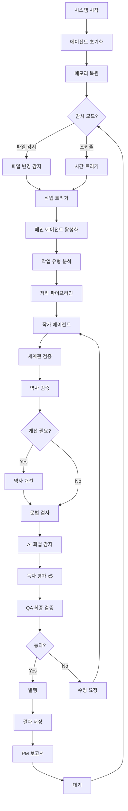

# 🔄 웹소설 24시간 자동화 알고리즘 상세 설명

## 📊 전체 시스템 플로우차트



---

## 🎯 핵심 알고리즘

### 1. 메인 오케스트레이션 알고리즘

```python
async def main_orchestration_algorithm():
    """
    메인 오케스트레이터의 핵심 알고리즘
    모든 에이전트를 조율하고 워크플로우 관리
    """
    
    # Phase 1: 초기화
    agents = initialize_all_agents()
    task_queue = AsyncQueue()
    
    # Phase 2: 작업 감지 루프
    while system_running:
        
        # 작업 소스 확인
        if file_changed():
            task = create_task_from_file()
        elif scheduled_time():
            task = create_scheduled_task()
        else:
            continue
            
        # Phase 3: 작업 처리
        result = await process_task_pipeline(task)
        
        # Phase 4: 결과 처리
        if result.success:
            await publish_episode(result)
        else:
            await request_revision(result)
            
        # Phase 5: 상태 업데이트
        update_system_state()
        await report_to_pm()
```

### 2. 파이프라인 처리 알고리즘

```python
async def process_task_pipeline(task):
    """
    순차적 파이프라인 처리
    각 단계는 이전 단계의 결과를 받아 처리
    """
    
    # 에피소드 ID 생성
    episode_id = generate_unique_id()
    
    # Stage 1: 콘텐츠 생성/로드
    if task.type == "new_episode":
        content = await writer_agent.create_episode()
    else:
        content = task.content
    
    # Stage 2: 검증 체인
    validations = {}
    
    # 2-1: 세계관 검증
    world_result = await worldbuilding_agent.verify(content)
    validations['world'] = world_result
    
    # 2-2: 역사 검증
    history_result = await history_agent.verify(content)
    validations['history'] = history_result
    
    # 2-3: 역사 개선 판단
    if history_result.has_conflicts:
        improvement = await history_improver.analyze(
            content, 
            history_result.conflicts
        )
        if improvement.should_update:
            await update_history(improvement.changes)
            # 재검증
            history_result = await history_agent.verify(content)
    
    # 2-4: 문법 검사
    grammar_result = await grammar_agent.check(content)
    content = apply_grammar_fixes(content, grammar_result)
    validations['grammar'] = grammar_result
    
    # 2-5: AI 패턴 감지
    ai_patterns = await ai_detection_agent.detect(content)
    content = reduce_ai_patterns(content, ai_patterns)
    validations['ai_patterns'] = ai_patterns
    
    # Stage 3: 병렬 독자 평가
    reader_tasks = []
    for reader in reader_agents:
        task = reader.evaluate(content)
        reader_tasks.append(task)
    
    reader_results = await asyncio.gather(*reader_tasks)
    validations['readers'] = reader_results
    
    # Stage 4: 최종 QA
    qa_result = await qa_agent.final_check(
        content,
        validations
    )
    
    return PipelineResult(
        episode_id=episode_id,
        content=content,
        validations=validations,
        qa_result=qa_result,
        success=qa_result.passed
    )
```

### 3. 지능형 재시도 알고리즘

```python
async def intelligent_retry_algorithm(task, max_retries=3):
    """
    실패시 지능적으로 재시도
    각 재시도마다 다른 전략 적용
    """
    
    retry_count = 0
    last_error = None
    
    while retry_count < max_retries:
        try:
            # 재시도 전략 선택
            if retry_count == 0:
                # 첫 시도: 일반 처리
                strategy = "normal"
            elif retry_count == 1:
                # 두 번째: 파라미터 조정
                strategy = "adjusted"
                adjust_parameters(task)
            else:
                # 세 번째: 대체 방법
                strategy = "alternative"
                task = create_alternative_task(task)
            
            # 처리 시도
            result = await process_with_strategy(task, strategy)
            
            if result.success:
                return result
            else:
                last_error = result.error
                retry_count += 1
                
                # 재시도 전 대기 (지수 백오프)
                wait_time = 2 ** retry_count
                await asyncio.sleep(wait_time)
                
        except Exception as e:
            last_error = e
            retry_count += 1
    
    # 최대 재시도 초과
    return FailureResult(
        task=task,
        error=last_error,
        retries=retry_count
    )
```

### 4. API 한도 관리 알고리즘

```python
class APILimitManager:
    """
    Claude API 사용량 추적 및 한도 관리
    """
    
    def __init__(self):
        self.daily_limit = 1_000_000  # tokens
        self.minute_limit = 50  # requests
        self.used_today = 0
        self.minute_requests = deque()
        
    async def request_with_limit(self, prompt):
        """
        한도를 고려한 API 요청
        """
        
        # Step 1: 일일 한도 체크
        estimated_tokens = len(prompt) * 1.5
        if self.used_today + estimated_tokens > self.daily_limit:
            # 한도 도달시 대기
            wait_until = tomorrow_midnight()
            await asyncio.sleep_until(wait_until)
            self.reset_daily_counter()
        
        # Step 2: 분당 한도 체크
        current_time = time.now()
        self.clean_old_requests(current_time)
        
        if len(self.minute_requests) >= self.minute_limit:
            # 분당 한도 도달
            oldest_request = self.minute_requests[0]
            wait_time = 60 - (current_time - oldest_request)
            await asyncio.sleep(wait_time)
        
        # Step 3: 요청 실행
        try:
            response = await claude_api.request(prompt)
            
            # Step 4: 사용량 업데이트
            actual_tokens = count_tokens(response)
            self.used_today += actual_tokens
            self.minute_requests.append(current_time)
            
            # Step 5: 로깅
            log_api_usage(actual_tokens)
            
            return response
            
        except RateLimitError as e:
            # API 자체 한도 에러
            await asyncio.sleep(e.retry_after)
            return await self.request_with_limit(prompt)
```

### 5. 메모리 관리 알고리즘

```python
class MemoryManagementSystem:
    """
    에이전트 메모리 효율적 관리
    """
    
    def __init__(self):
        self.memory_limit = 1_000_000  # characters
        self.memory_store = {}
        self.access_frequency = {}
        
    def store_memory(self, agent_id, key, value):
        """
        메모리 저장 with LRU 캐시
        """
        
        # 크기 체크
        value_size = len(str(value))
        
        # 메모리 부족시 정리
        while self.get_total_size() + value_size > self.memory_limit:
            self.evict_least_used()
        
        # 저장
        if agent_id not in self.memory_store:
            self.memory_store[agent_id] = {}
            
        self.memory_store[agent_id][key] = {
            'value': value,
            'timestamp': time.now(),
            'access_count': 0
        }
        
        # 디스크 백업 (중요 데이터)
        if self.is_critical(key):
            self.backup_to_disk(agent_id, key, value)
    
    def retrieve_memory(self, agent_id, key):
        """
        메모리 검색 with 캐싱
        """
        
        # 메모리에서 찾기
        if agent_id in self.memory_store:
            if key in self.memory_store[agent_id]:
                # 접근 빈도 업데이트
                self.memory_store[agent_id][key]['access_count'] += 1
                return self.memory_store[agent_id][key]['value']
        
        # 디스크에서 복원
        disk_value = self.restore_from_disk(agent_id, key)
        if disk_value:
            self.store_memory(agent_id, key, disk_value)
            return disk_value
            
        return None
    
    def evict_least_used(self):
        """
        LRU 정책으로 메모리 정리
        """
        
        min_score = float('inf')
        evict_agent = None
        evict_key = None
        
        for agent_id, memories in self.memory_store.items():
            for key, data in memories.items():
                # 점수 계산 (낮을수록 제거 우선)
                age = time.now() - data['timestamp']
                score = data['access_count'] / (age + 1)
                
                if score < min_score:
                    min_score = score
                    evict_agent = agent_id
                    evict_key = key
        
        # 제거
        if evict_agent and evict_key:
            del self.memory_store[evict_agent][evict_key]
```

### 6. 병렬 처리 최적화 알고리즘

```python
async def parallel_processing_optimizer():
    """
    독립적인 작업들을 병렬로 처리하여 속도 향상
    """
    
    async def process_episode_optimized(content):
        """
        의존성 없는 작업들을 병렬 처리
        """
        
        # Phase 1: 독립적 검증 (병렬)
        parallel_tasks = [
            worldbuilding_agent.verify(content),
            grammar_agent.check(content),
            ai_detection_agent.detect(content),
        ]
        
        # 동시 실행
        world_result, grammar_result, ai_result = await asyncio.gather(
            *parallel_tasks
        )
        
        # Phase 2: 의존적 검증 (순차)
        history_result = await history_agent.verify(content)
        
        if history_result.needs_improvement:
            improvement = await history_improver.process(
                content, 
                history_result
            )
            history_result = await history_agent.verify(content)
        
        # Phase 3: 독자 평가 (병렬)
        reader_tasks = [
            reader.evaluate(content) 
            for reader in reader_agents
        ]
        reader_results = await asyncio.gather(*reader_tasks)
        
        # Phase 4: 최종 QA
        qa_result = await qa_agent.validate_all(
            content,
            world_result,
            history_result,
            grammar_result,
            ai_result,
            reader_results
        )
        
        return qa_result
```

### 7. 피드백 학습 알고리즘

```python
class FeedbackLearningSystem:
    """
    독자 피드백을 학습하여 품질 개선
    """
    
    def __init__(self):
        self.feedback_history = []
        self.preference_model = {}
        
    async def learn_from_feedback(self, episode_id, feedbacks):
        """
        피드백 분석 및 학습
        """
        
        # Step 1: 피드백 집계
        aggregated = {
            'positive': [],
            'negative': [],
            'suggestions': []
        }
        
        for feedback in feedbacks:
            # 감정 분석
            sentiment = analyze_sentiment(feedback)
            
            if sentiment > 0.7:
                aggregated['positive'].append(feedback)
            elif sentiment < 0.3:
                aggregated['negative'].append(feedback)
            
            # 제안 추출
            suggestions = extract_suggestions(feedback)
            aggregated['suggestions'].extend(suggestions)
        
        # Step 2: 패턴 학습
        patterns = self.extract_patterns(aggregated)
        
        # Step 3: 선호도 모델 업데이트
        self.update_preference_model(patterns)
        
        # Step 4: 다음 에피소드에 반영
        writing_guidelines = self.generate_guidelines()
        
        return writing_guidelines
    
    def extract_patterns(self, aggregated):
        """
        반복되는 피드백 패턴 추출
        """
        
        patterns = {
            'liked_elements': Counter(),
            'disliked_elements': Counter(),
            'requested_features': Counter()
        }
        
        # 긍정 패턴
        for positive in aggregated['positive']:
            elements = extract_story_elements(positive)
            patterns['liked_elements'].update(elements)
        
        # 부정 패턴
        for negative in aggregated['negative']:
            elements = extract_story_elements(negative)
            patterns['disliked_elements'].update(elements)
        
        # 요청 사항
        for suggestion in aggregated['suggestions']:
            patterns['requested_features'][suggestion] += 1
        
        return patterns
    
    def generate_guidelines(self):
        """
        학습된 내용으로 작성 가이드라인 생성
        """
        
        guidelines = {
            'must_include': [],
            'should_avoid': [],
            'consider_adding': []
        }
        
        # 인기 요소 포함
        for element, count in self.preference_model['liked'].most_common(5):
            if count > 10:  # 충분한 데이터
                guidelines['must_include'].append(element)
        
        # 비인기 요소 제외
        for element, count in self.preference_model['disliked'].most_common(5):
            if count > 5:
                guidelines['should_avoid'].append(element)
        
        # 요청 사항 고려
        for feature, count in self.preference_model['requested'].most_common(3):
            if count > 3:
                guidelines['consider_adding'].append(feature)
        
        return guidelines
```

---

## 🔄 시스템 최적화 전략

### 1. 캐싱 전략
```python
# 반복 요청 캐싱
cache = LRUCache(maxsize=1000)

@cache.memoize(expire=3600)
async def cached_api_request(prompt_hash):
    return await claude_api.request(prompt)
```

### 2. 배치 처리
```python
# 여러 작업을 모아서 한번에 처리
batch = []
while len(batch) < 10 and not timeout:
    task = await queue.get(timeout=1)
    batch.append(task)

results = await process_batch(batch)
```

### 3. 우선순위 큐
```python
# 중요도에 따른 작업 순서 조정
priority_queue = PriorityQueue()

priority_queue.put((1, critical_task))  # 높은 우선순위
priority_queue.put((5, normal_task))    # 보통 우선순위
priority_queue.put((10, low_task))      # 낮은 우선순위
```

---

## 📊 성능 메트릭

### 처리 시간 목표
- 에피소드 생성: < 3분
- 전체 파이프라인: < 10분
- 병렬 처리로 50% 단축

### 품질 목표
- 세계관 일관성: > 95%
- 문법 정확도: > 98%
- 독자 만족도: > 8.0/10

### 비용 최적화
- API 호출 최소화
- 캐싱으로 30% 절감
- 배치 처리로 20% 절감