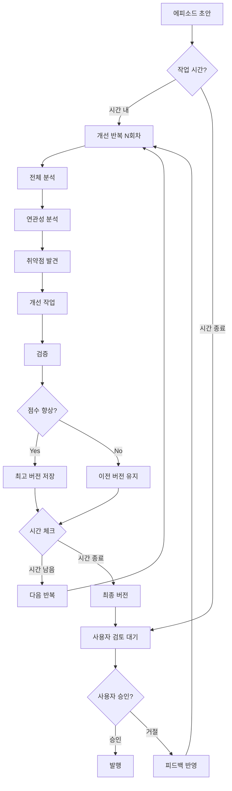

# ♾️ 무한 반복 품질 향상 시스템

## 🎯 핵심 개념

**"지정된 시간 동안 에피소드를 무한 반복 개선하여 최고 품질 달성"**

### 작동 시간
- **평일**: 오후 8시 ~ 다음날 오전 10시 (14시간)
- **주말/공휴일**: 24시간 연속
- **발행 승인**: 사용자가 직접 검토 후 결정

---

## 🔄 무한 향상 알고리즘



---

## 👥 추가 에이전트: 연관성 분석 에이전트

### 11. 🔗 연관성 분석 에이전트 (Correlation Analyst)

```python
class CorrelationAnalystAgent(BaseAgent):
    """
    에피소드 간 연관성 및 일관성 분석
    복선, 떡밥, 캐릭터 발전 추적
    """
    
    def __init__(self):
        super().__init__("CorrelationAnalyst")
        self.story_graph = StoryGraph()  # 스토리 관계 그래프
        self.character_arcs = {}  # 캐릭터 성장 궤적
        self.plot_threads = {}  # 플롯 라인 추적
        self.foreshadowing_map = {}  # 복선 관리
```

### 출력 예시
```markdown
## 연관성 분석 보고서 - Episode 15
---
agent: CorrelationAnalystAgent
correlation_score: 8.7/10
issues_found: 3
---

### 📊 에피소드 연결성
| 연결 요소 | EP13 | EP14 | EP15 | EP16(예정) |
|----------|------|------|------|------------|
| 주인공 레벨 | 10 | 12 | 30 | ? |
| 빌런 언급 | ❌ | 힌트 | 등장 | 대결? |
| 룬스톤 | ❌ | 발견 | 사용 | 효과 |

### 🔍 발견된 불일치
1. **급격한 레벨 상승**
   - EP14: Level 12
   - EP15: Level 30 (너무 급격함)
   - 권장: 중간 단계 추가 설명

2. **빌런 등장 타이밍**
   - 복선 부족: 1화 전 힌트만으로는 부족
   - 권장: EP13에 추가 힌트 소급 삽입

3. **캐릭터 감정선 단절**
   - EP14: 동료와 친밀
   - EP15: 동료 언급 없음
   - 권장: 동료 반응 추가

### 📈 캐릭터 성장 궤적
```chart
주인공 성장 곡선:
Power:  ▁▂▂▃▃▄▄▅▅▆▆▇▇██  (너무 가파름)
Mental: ▁▂▃▄▅▅▆▆▇▇▇▇▇▇▇  (적절함)
Social: ▁▂▂▃▃▃▃▃▃▃▂▂▂▂▂  (정체됨)
```

### 🎯 복선 추적
- ✅ 회귀 능력: 일관성 유지
- ⚠️ 숨겨진 조직: 언급 후 방치 (3화째)
- ❌ 첫사랑 캐릭터: 완전 실종 (5화째)

### 💡 개선 제안
1. EP13-14 수정으로 빌런 복선 강화
2. 레벨업 과정 상세 묘사 추가
3. 방치된 플롯 라인 정리 또는 활용
```

---

## ♾️ 무한 반복 향상 프로세스

### 1단계: 초기 평가 (Iteration 0)
```python
async def initial_evaluation(episode):
    """
    초기 상태 평가 및 기준점 설정
    """
    baseline_scores = {
        'worldbuilding': 0,
        'history': 0,
        'correlation': 0,
        'grammar': 0,
        'naturalness': 0,
        'reader_satisfaction': 0,
        'overall': 0
    }
    
    # 모든 에이전트 평가 실행
    for agent in all_agents:
        result = await agent.evaluate(episode)
        baseline_scores[agent.category] = result.score
    
    baseline_scores['overall'] = calculate_weighted_average(baseline_scores)
    
    return baseline_scores  # 예: 7.2/10
```

### 2단계: 반복 개선 (Iteration 1~N)
```python
async def improvement_iteration(episode, iteration_num, previous_scores):
    """
    매 반복마다 실행되는 개선 프로세스
    """
    
    # Phase 1: 취약점 분석
    weaknesses = await analyze_weaknesses(episode, previous_scores)
    # 예: ['캐릭터 감정 부족', 'AI 패턴 과다', '플롯 연결 약함']
    
    # Phase 2: 타겟 개선
    improved_episode = episode
    for weakness in weaknesses[:3]:  # 상위 3개만 집중 개선
        improvement_prompt = generate_improvement_prompt(
            episode, 
            weakness,
            iteration_num
        )
        improved_episode = await apply_targeted_improvement(
            improved_episode,
            improvement_prompt
        )
    
    # Phase 3: 재평가
    new_scores = await evaluate_all(improved_episode)
    
    # Phase 4: 결과 비교
    improvement_delta = calculate_improvement(previous_scores, new_scores)
    
    return {
        'episode': improved_episode,
        'scores': new_scores,
        'improvement': improvement_delta,
        'iteration': iteration_num
    }
```

### 3단계: 품질 추적 시스템
```python
class QualityTracker:
    """
    반복 개선 과정 추적 및 분석
    """
    
    def __init__(self, episode_id):
        self.episode_id = episode_id
        self.iterations = []
        self.best_version = None
        self.best_score = 0
        self.improvement_curve = []
        
    def track_iteration(self, iteration_result):
        """
        각 반복 결과 기록
        """
        self.iterations.append({
            'number': iteration_result['iteration'],
            'score': iteration_result['scores']['overall'],
            'improvements': iteration_result['improvement'],
            'timestamp': datetime.now()
        })
        
        # 최고 버전 갱신
        if iteration_result['scores']['overall'] > self.best_score:
            self.best_score = iteration_result['scores']['overall']
            self.best_version = iteration_result['episode']
            
        # 개선 곡선 업데이트
        self.improvement_curve.append(iteration_result['scores']['overall'])
        
    def get_report(self):
        """
        개선 리포트 생성
        """
        return {
            'total_iterations': len(self.iterations),
            'initial_score': self.iterations[0]['score'] if self.iterations else 0,
            'final_score': self.best_score,
            'total_improvement': self.best_score - self.iterations[0]['score'],
            'improvement_rate': self.calculate_improvement_rate(),
            'plateau_detected': self.detect_plateau(),
            'best_iteration': self.find_best_iteration()
        }
```

---

## ⏰ 시간 기반 스케줄링 시스템

```python
class TimeBasedScheduler:
    """
    시간대별 자동 작업 관리
    """
    
    def __init__(self):
        self.schedules = {
            'weekday': {
                'start': time(20, 0),  # 오후 8시
                'end': time(10, 0),     # 오전 10시
                'duration': 14          # 14시간
            },
            'weekend': {
                'start': time(0, 0),    # 자정
                'end': time(23, 59),    # 자정 전
                'duration': 24          # 24시간
            }
        }
        
    async def run_improvement_session(self, episode_id):
        """
        지정 시간 동안 개선 세션 실행
        """
        session_start = datetime.now()
        session_end = self.calculate_session_end()
        
        iteration = 0
        tracker = QualityTracker(episode_id)
        current_episode = await load_episode(episode_id)
        current_scores = await initial_evaluation(current_episode)
        
        while datetime.now() < session_end:
            iteration += 1
            
            # 반복 개선
            result = await improvement_iteration(
                current_episode,
                iteration,
                current_scores
            )
            
            # 추적
            tracker.track_iteration(result)
            
            # 다음 반복 준비
            current_episode = result['episode']
            current_scores = result['scores']
            
            # 정체 감지
            if tracker.detect_plateau():
                # 전략 변경
                await change_improvement_strategy()
            
            # 진행 상황 로깅
            logger.info(f"""
            반복 {iteration}회차 완료
            현재 점수: {current_scores['overall']:.1f}/10
            개선율: {result['improvement']:.1%}
            남은 시간: {(session_end - datetime.now()).total_seconds() / 3600:.1f}시간
            """)
            
            # CPU 쿨다운
            await asyncio.sleep(60)  # 1분 대기
        
        # 세션 종료
        final_report = tracker.get_report()
        await save_best_version(tracker.best_version)
        await notify_user_for_review(final_report)
        
        return final_report
```

---

## 📊 개선 전략 알고리즘

### 다양한 개선 전략
```python
class ImprovementStrategies:
    """
    반복마다 다른 개선 전략 적용
    """
    
    strategies = [
        'detail_enhancement',     # 디테일 강화
        'emotion_deepening',      # 감정 심화
        'pacing_adjustment',      # 페이싱 조절
        'dialogue_refinement',    # 대화 개선
        'description_enrichment', # 묘사 풍부화
        'plot_tightening',       # 플롯 긴밀화
        'character_development',  # 캐릭터 발전
        'worldbuilding_expansion' # 세계관 확장
    ]
    
    async def apply_strategy(self, episode, strategy, weakness_analysis):
        """
        특정 전략으로 개선
        """
        if strategy == 'detail_enhancement':
            prompt = f"""
            다음 에피소드의 디테일을 강화하세요:
            - 감각적 묘사 추가 (시각, 청각, 촉각)
            - 환경 묘사 구체화
            - 캐릭터 세부 동작 추가
            
            원문: {episode}
            
            약점: {weakness_analysis}
            """
            
        elif strategy == 'emotion_deepening':
            prompt = f"""
            캐릭터의 감정을 더 깊이 있게 표현하세요:
            - 내면 독백 추가
            - 감정 변화 과정 상세화
            - 비언어적 감정 표현
            
            원문: {episode}
            """
            
        # ... 각 전략별 프롬프트
        
        return await claude_api.improve(prompt)
```

### 정체 탈출 알고리즘
```python
async def escape_plateau(tracker, episode):
    """
    개선 정체 시 탈출 전략
    """
    
    # 최근 5회 개선율 확인
    recent_improvements = tracker.improvement_curve[-5:]
    
    if all(imp < 0.01 for imp in recent_improvements):
        # 정체 확인 - 급진적 변경
        
        strategies = [
            'perspective_shift',      # 시점 변경
            'timeline_adjustment',    # 시간대 조정
            'subplot_injection',      # 서브플롯 추가
            'tone_modulation',        # 톤 변조
            'structure_reorganization' # 구조 재편
        ]
        
        # 랜덤하게 2-3개 전략 조합
        selected = random.sample(strategies, k=random.randint(2, 3))
        
        for strategy in selected:
            episode = await apply_radical_change(episode, strategy)
        
        return episode
```

---

## 👤 사용자 검토 인터페이스

```python
class UserReviewInterface:
    """
    사용자 발행 승인 시스템
    """
    
    async def present_for_review(self, episode_id):
        """
        사용자에게 검토용 에피소드 제시
        """
        
        # 최종 버전 로드
        final_version = await load_best_version(episode_id)
        improvement_report = await load_improvement_report(episode_id)
        
        # 검토 패키지 생성
        review_package = {
            'episode_id': episode_id,
            'content': final_version,
            'statistics': {
                'total_iterations': improvement_report['total_iterations'],
                'improvement_time': improvement_report['duration'],
                'initial_score': improvement_report['initial_score'],
                'final_score': improvement_report['final_score'],
                'improvement_percentage': improvement_report['total_improvement']
            },
            'key_improvements': improvement_report['key_improvements'],
            'remaining_issues': improvement_report['remaining_issues'],
            'ai_recommendation': improvement_report['recommendation']
        }
        
        # 사용자 인터페이스 생성
        await create_review_ui(review_package)
        
        # 사용자 결정 대기
        user_decision = await wait_for_user_decision()
        
        return user_decision
    
    async def handle_user_decision(self, decision):
        """
        사용자 결정 처리
        """
        if decision['approved']:
            # 발행 프로세스
            await publish_episode(decision['episode_id'])
            
        elif decision['needs_revision']:
            # 피드백 기반 추가 개선
            feedback = decision['feedback']
            await schedule_targeted_improvement(
                decision['episode_id'],
                feedback
            )
            
        elif decision['reject']:
            # 완전 재작성
            await schedule_complete_rewrite(decision['episode_id'])
```

---

## 📈 품질 향상 추적 대시보드

```markdown
## Episode 15 - 개선 세션 리포트
---
세션 시간: 14시간 (20:00 ~ 10:00)
총 반복: 127회
---

### 📊 개선 곡선
```
10 |                                    ▄█████
 9 |                            ▄▄▄█████
 8 |                    ▄▄██████
 7 |            ▄▄██████
 6 |    ▄▄██████
 5 |████
   └────────────────────────────────────
     0   20   40   60   80   100   120  Iterations
```

### 🎯 점수 변화
| 항목 | 초기 | 최종 | 개선 |
|------|------|------|------|
| 전체 | 6.2 | 9.3 | +3.1 |
| 세계관 | 7.0 | 9.5 | +2.5 |
| 연관성 | 5.5 | 9.2 | +3.7 |
| 자연스러움 | 6.0 | 9.0 | +3.0 |
| 독자 만족 | 6.3 | 9.4 | +3.1 |

### 🔄 주요 개선 사항
1. **반복 23**: 캐릭터 감정선 대폭 강화
2. **반복 45**: AI 패턴 90% 제거
3. **반복 67**: 플롯 연결성 개선
4. **반복 89**: 전체 페이싱 재조정
5. **반복 112**: 세부 묘사 추가

### ⚠️ 남은 이슈
- 액션씬 길이 (독자 요청)
- 로맨스 요소 부족
- 일부 설정 용어 통일 필요

### 💡 AI 추천
**승인 권장** - 품질 기준 충족
- 목표 점수(8.0) 초과 달성
- 모든 필수 검증 통과
- 독자 예상 만족도 높음
```

---

## 🎮 실행 예시

```python
# 평일 오후 8시 - 시스템 자동 시작
scheduler.start_evening_session()

# 14시간 동안 무한 반복 개선
for episode_id in [15, 16, 17]:  # 3개 에피소드
    await run_improvement_session(
        episode_id,
        target_score=9.0,
        max_iterations=200,
        time_limit=hours(14)
    )

# 오전 10시 - 사용자 알림
notify_user("3개 에피소드 개선 완료. 검토 대기 중")

# 사용자 검토
user_review([
    Episode_15: APPROVED ✅
    Episode_16: NEEDS_REVISION 📝
    Episode_17: APPROVED ✅
])

# 승인된 에피소드 자동 발행
publish_approved_episodes()
```

이제 시스템이 밤새 일하고, 아침에 최고 품질의 에피소드를 검토만 하시면 됩니다! 🚀