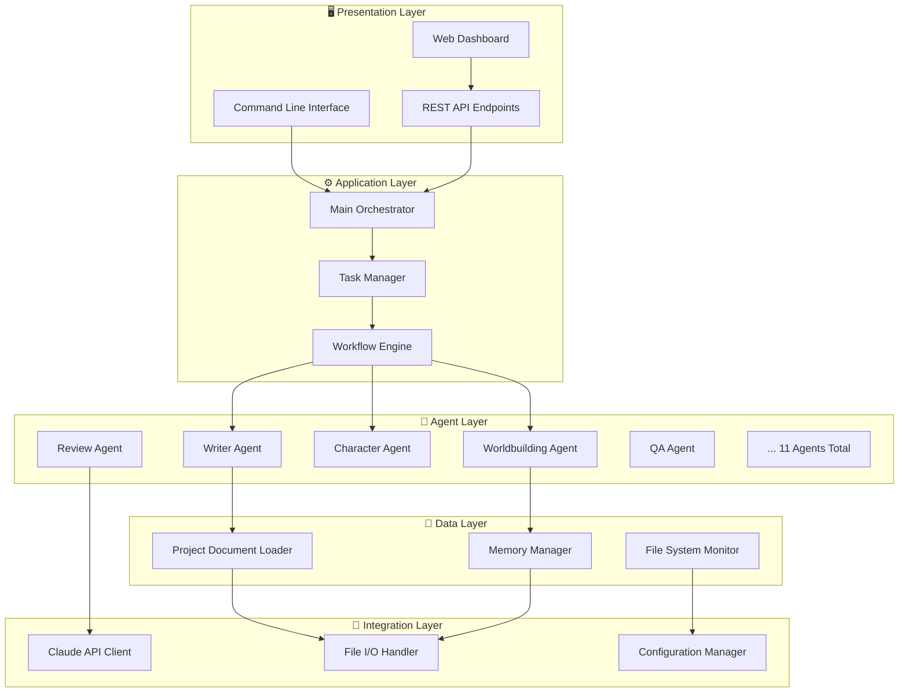
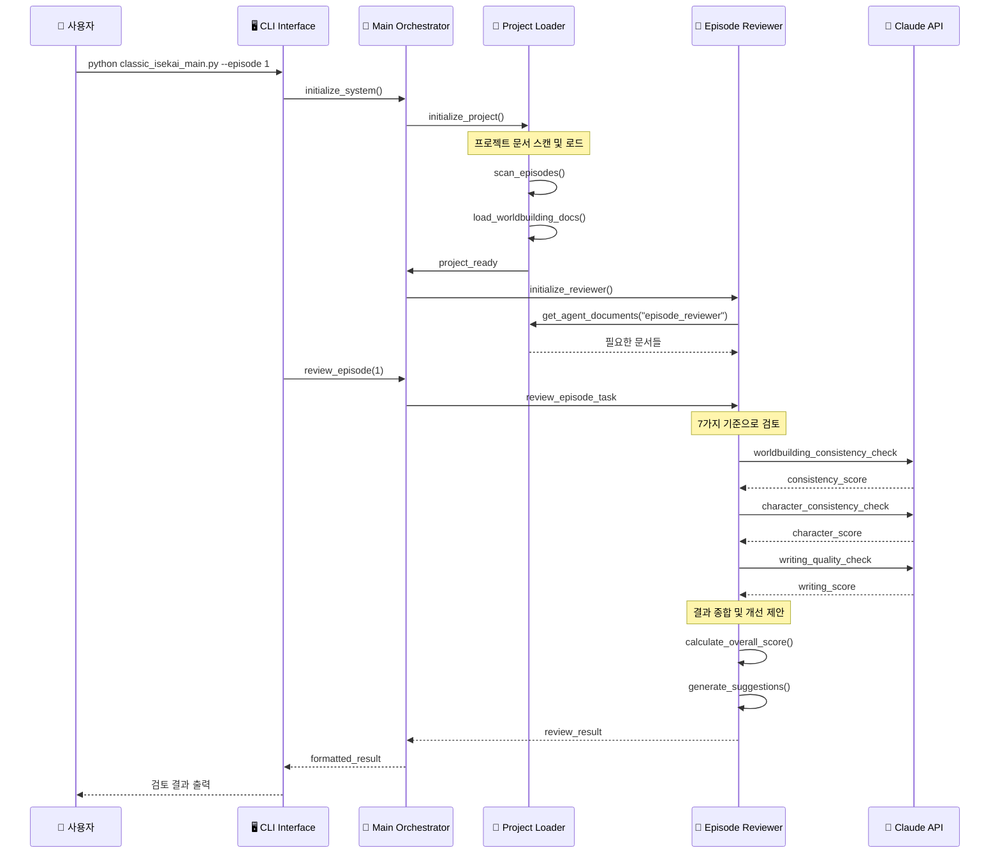
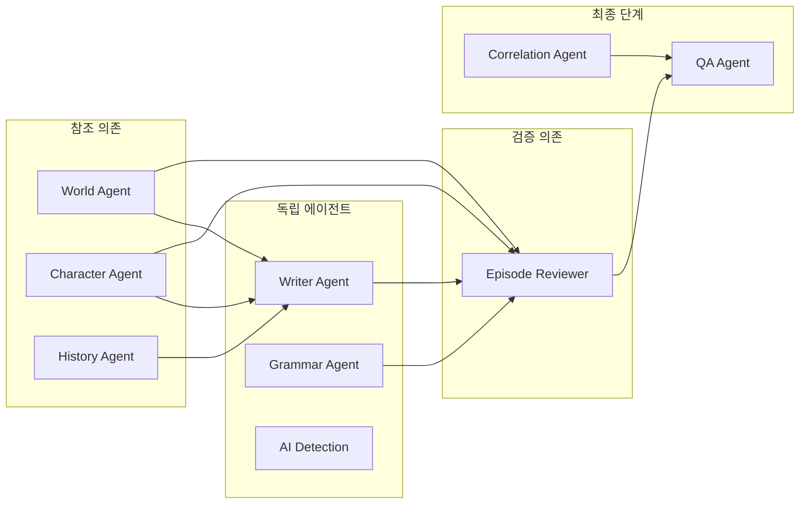

# 🏗️ 웹소설 자동화 시스템 아키텍처

## 📋 목차
1. [전체 시스템 개요](#전체-시스템-개요)
2. [레이어별 아키텍처](#레이어별-아키텍처)
3. [컴포넌트 상세 설계](#컴포넌트-상세-설계)
4. [데이터 플로우](#데이터-플로우)
5. [에이전트 통신 구조](#에이전트-통신-구조)
6. [Classic Isekai 전용 구조](#classic-isekai-전용-구조)

---

## 전체 시스템 개요

### 🎯 아키텍처 원칙
- **모듈화**: 각 에이전트는 독립적으로 작동
- **확장성**: 새로운 에이전트 쉽게 추가 가능
- **재사용성**: 다른 웹소설 프로젝트에도 적용 가능
- **유지보수성**: 각 컴포넌트가 명확히 분리

### 📊 시스템 계층 구조



---

## 레이어별 아키텍처

### 1️⃣ **Presentation Layer (프레젠테이션 계층)**

#### **역할**: 사용자 인터페이스 제공

```python
# 계층 구조
webnovel-automation/
├── classic_isekai_main.py      # CLI 메인 인터페이스
├── web_interface/              # 웹 대시보드 (선택사항)
│   ├── dashboard.py
│   ├── templates/
│   └── static/
└── api/                        # REST API
    ├── endpoints.py
    └── schemas.py
```

#### **컴포넌트**:
- **CLI Interface**: 대화형 커맨드라인
- **Web Dashboard**: 실시간 모니터링 (향후)
- **REST API**: 외부 시스템 연동 (향후)

---

### 2️⃣ **Application Layer (애플리케이션 계층)**

#### **역할**: 비즈니스 로직 및 워크플로우 관리

```python
# 핵심 컴포넌트
├── agents/
│   ├── main_agent.py           # 🎯 메인 오케스트레이터
│   ├── workflow_engine.py      # ⚙️ 워크플로우 엔진
│   └── task_manager.py         # 📋 작업 관리자
```

#### **메인 오케스트레이터 구조**:
```python
class MainOrchestrator:
    """전체 시스템 조율"""
    
    def __init__(self):
        self.agents = {}           # 에이전트 레지스트리
        self.task_queue = Queue()  # 작업 큐
        self.workflow = Pipeline() # 처리 파이프라인
        
    async def orchestrate_workflow(self, task):
        """워크플로우 실행"""
        # 1. 작업 분석
        task_type = self.analyze_task(task)
        
        # 2. 파이프라인 구성
        pipeline = self.build_pipeline(task_type)
        
        # 3. 에이전트 실행
        result = await self.execute_pipeline(pipeline, task)
        
        return result
```

---

### 3️⃣ **Agent Layer (에이전트 계층)**

#### **역할**: 전문 기능 수행

```python
# 11개 전문 에이전트
agents/
├── base_agent.py               # 🏗️ 기본 에이전트 클래스
├── writer_agent.py             # ✍️ 작가 에이전트  
├── worldbuilding_agent.py      # 🌍 세계관 담당
├── character_agent.py          # 👥 캐릭터 담당
├── history_agent.py            # 📜 역사 담당
├── grammar_agent.py            # 📝 문법 담당
├── ai_detection_agent.py       # 🤖 AI 화법 감지
├── reader_agent.py             # 👥 독자 시뮬레이션
├── qa_agent.py                 # ✅ 품질 보증
├── correlation_agent.py        # 🔗 연관성 분석
├── episode_reviewer.py         # 📖 에피소드 검토 (Classic Isekai)
└── project_loader.py           # 📁 프로젝트 문서 로더
```

#### **에이전트 기본 구조**:
```python
class BaseAgent(ABC):
    """모든 에이전트의 기본 클래스"""
    
    def __init__(self, name: str):
        self.name = name
        self.memory = {}           # 에이전트별 메모리
        self.message_queue = Queue() # 메시지 큐
        self.claude_client = None    # Claude API 클라이언트
        
    @abstractmethod
    async def execute(self, task: Dict) -> Any:
        """각 에이전트가 구현해야 할 실행 메서드"""
        pass
        
    async def call_claude(self, prompt: str) -> str:
        """Claude API 호출 (공통 기능)"""
        pass
        
    def save_memory(self, key: str, value: Any):
        """메모리 저장 (공통 기능)"""
        pass
```

#### **에이전트별 특화 구조**:

**작가 에이전트**:
```python
class WriterAgent(BaseAgent):
    def __init__(self):
        super().__init__("Writer")
        self.story_memory = {}     # 스토리 진행 상황
        self.character_states = {} # 캐릭터 상태
        self.world_context = {}    # 세계관 컨텍스트
        
    async def create_episode(self, requirements):
        # 에피소드 생성 로직
        pass
```

**세계관 담당**:
```python
class WorldbuildingAgent(BaseAgent):
    def __init__(self):
        super().__init__("Worldbuilding")
        self.world_rules = {}      # 세계관 규칙
        self.consistency_log = []  # 일관성 검증 기록
        
    async def verify_consistency(self, content):
        # 세계관 일관성 검증
        pass
```

---

### 4️⃣ **Data Layer (데이터 계층)**

#### **역할**: 데이터 관리 및 저장

```python
# 데이터 관리 컴포넌트
├── agents/project_loader.py    # 📁 프로젝트 문서 로더
├── memory/                     # 💾 에이전트 메모리
│   ├── agent_memory.json
│   ├── world_state.json
│   └── episode_progress.json
├── config/                     # ⚙️ 설정 관리
│   ├── config.yaml
│   └── classic_isekai_project.yaml
└── logs/                       # 📊 로그 저장
    ├── system.log
    └── agent_activity.log
```

#### **프로젝트 로더 구조**:
```python
class ProjectDocumentLoader:
    """프로젝트 문서 로딩 및 관리"""
    
    def __init__(self, config_path: str):
        self.base_path = Path()    # 프로젝트 기본 경로
        self.documents = {}        # 로드된 문서 캐시
        self.agent_assignments = {} # 에이전트별 문서 할당
        
    async def initialize_project(self):
        """프로젝트 초기화"""
        # 1. 폴더 구조 스캔
        await self.scan_project_structure()
        
        # 2. 핵심 문서 로드
        await self.load_core_documents()
        
        # 3. 에이전트별 문서 할당
        await self.assign_documents_to_agents()
        
    def get_agent_documents(self, agent_name: str) -> Dict:
        """에이전트가 읽어야 할 문서들 반환"""
        return self.agent_assignments.get(agent_name, {})
```

---

### 5️⃣ **Integration Layer (통합 계층)**

#### **역할**: 외부 서비스 및 시스템 연동

```python
# 통합 컴포넌트
├── integrations/
│   ├── claude_client.py        # 🤖 Claude API 클라이언트
│   ├── file_handler.py         # 📄 파일 처리
│   └── config_manager.py       # ⚙️ 설정 관리
```

#### **Claude API 클라이언트**:
```python
class ClaudeAPIClient:
    """Claude API 통합 및 한도 관리"""
    
    def __init__(self):
        self.client = Anthropic()
        self.rate_limiter = RateLimiter()  # API 한도 관리
        self.usage_tracker = UsageTracker() # 사용량 추적
        
    async def request_with_retry(self, prompt: str):
        """재시도 로직을 포함한 API 요청"""
        # 1. 한도 체크
        await self.rate_limiter.check_limits()
        
        # 2. 요청 실행
        try:
            response = await self.client.messages.create(...)
            self.usage_tracker.log_usage(response)
            return response
        except RateLimitError:
            # 3. 한도 도달시 대기
            await self.rate_limiter.wait_for_reset()
            return await self.request_with_retry(prompt)
```

---

## 컴포넌트 상세 설계

### 🔄 **워크플로우 엔진**

#### **파이프라인 구조**:
```python
class WorkflowPipeline:
    """에이전트 실행 파이프라인"""
    
    def __init__(self):
        self.stages = []           # 실행 단계
        self.parallel_groups = []  # 병렬 처리 그룹
        
    def add_stage(self, agent, dependencies=[]):
        """실행 단계 추가"""
        stage = {
            'agent': agent,
            'dependencies': dependencies,
            'parallel_group': None
        }
        self.stages.append(stage)
    
    def create_parallel_group(self, agents):
        """병렬 실행 그룹 생성"""
        group_id = len(self.parallel_groups)
        for agent in agents:
            self.add_stage(agent, parallel_group=group_id)
        
    async def execute(self, task):
        """파이프라인 실행"""
        results = {}
        
        # 순차 실행
        for stage in self.sequential_stages:
            result = await stage['agent'].execute(task)
            results[stage['agent'].name] = result
            
        # 병렬 실행
        for group in self.parallel_groups:
            parallel_results = await asyncio.gather(*[
                agent.execute(task) for agent in group
            ])
            results.update(parallel_results)
            
        return results
```

#### **Classic Isekai 전용 파이프라인**:
```python
# 에피소드 검토 파이프라인
review_pipeline = WorkflowPipeline()

# 1단계: 문서 로딩
review_pipeline.add_stage(project_loader)

# 2단계: 병렬 검증
review_pipeline.create_parallel_group([
    worldbuilding_agent,    # 세계관 검증
    character_agent,        # 캐릭터 검증
    grammar_agent          # 문법 검사
])

# 3단계: 연관성 분석
review_pipeline.add_stage(correlation_agent, 
                         dependencies=[worldbuilding_agent, character_agent])

# 4단계: 최종 QA
review_pipeline.add_stage(qa_agent, 
                         dependencies=[correlation_agent])
```

---

## 데이터 플로우

### 📊 **Classic Isekai 검토 프로세스**



### 🔄 **데이터 흐름 패턴**

#### **1. 문서 로딩 플로우**:
```
프로젝트 폴더 스캔
    ↓
핵심 문서 식별 (INDEX.md, 소설정보.md 등)
    ↓
에이전트별 필요 문서 매핑
    ↓
문서 내용 메모리 캐싱
    ↓
에이전트에게 문서 전달
```

#### **2. 에피소드 검토 플로우**:
```
에피소드 파일 읽기
    ↓
세계관 문서와 대조 검증
    ↓
캐릭터 설정과 일관성 체크
    ↓
이전 에피소드와 연결성 확인
    ↓
7가지 기준으로 점수 산출
    ↓
개선 제안 생성
```

#### **3. 메모리 관리 플로우**:
```
에이전트별 메모리 파일 생성
    ↓
작업 결과를 메모리에 저장
    ↓
다음 작업시 메모리에서 복원
    ↓
주기적으로 메모리 최적화
```

---

## 에이전트 통신 구조

### 📡 **메시지 패싱 시스템**

```python
class MessageBus:
    """에이전트 간 메시지 전달"""
    
    def __init__(self):
        self.queues = {}           # 에이전트별 메시지 큐
        self.subscribers = {}      # 이벤트 구독자
        
    async def send_message(self, sender: str, receiver: str, message: Dict):
        """메시지 전송"""
        if receiver in self.queues:
            await self.queues[receiver].put({
                'sender': sender,
                'timestamp': datetime.now(),
                'content': message
            })
            
    async def broadcast(self, sender: str, event_type: str, data: Dict):
        """이벤트 브로드캐스트"""
        subscribers = self.subscribers.get(event_type, [])
        for subscriber in subscribers:
            await self.send_message(sender, subscriber, {
                'event': event_type,
                'data': data
            })
```

### 🔗 **에이전트 간 의존성**



---

## Classic Isekai 전용 구조

### 🎯 **프로젝트별 특화 설계**

#### **1. 문서 매핑 구조**:
```yaml
# classic_isekai_project.yaml
agent_documents:
  episode_reviewer:
    primary:
      - "webnovel_episodes/000_소설정보.md"    # 작문 가이드
      - "world_setting/021_resonance_system.md" # 공명력 시스템
      - "world_setting/100_protagonist.md"      # 주인공 설정
    reference:
      - "world_setting/110_story_bible.md"      # 스토리 바이블
      - "docs/episode_guide.md"                # 에피소드 가이드
```

#### **2. 검토 기준 특화**:
```python
# Classic Isekai 전용 검토 기준
CLASSIC_ISEKAI_CRITERIA = {
    'worldbuilding_consistency': {
        'resonance_system': 0.4,      # 공명력 시스템 일관성
        'terminology': 0.3,           # 용어 통일성
        'world_rules': 0.3            # 세계 규칙 준수
    },
    'genre_appropriateness': {
        'post_apocalyptic_atmosphere': 0.5,  # 포스트 아포칼립스 분위기
        'fantasy_elements': 0.3,             # 판타지 요소
        'reader_expectations': 0.2           # 독자 기대 충족
    }
}
```

#### **3. 에피소드별 상태 추적**:
```python
# 에피소드 진행 상태 관리
episode_status = {
    'completed': [1, 2, 3],      # 완성된 에피소드
    'in_review': [],             # 검토 중
    'needs_improvement': [],     # 개선 필요
    'approved': []              # 승인 완료
}
```

---

## 🏆 아키텍처 장점

### **1. 모듈화 설계**
- **독립적 에이전트**: 각자 전문 영역 담당
- **표준 인터페이스**: BaseAgent 상속으로 일관성 유지
- **플러그인 구조**: 새 에이전트 쉽게 추가

### **2. 확장성**
- **프로젝트별 특화**: config 파일로 다른 프로젝트 지원
- **파이프라인 조합**: 필요에 따라 에이전트 조합 변경
- **병렬 처리**: 독립적 작업은 동시 실행

### **3. 유지보수성**
- **명확한 책임 분리**: 각 계층별 역할 구분
- **에러 격리**: 한 에이전트 오류가 전체에 영향 안 줌
- **테스트 가능**: 각 컴포넌트 독립적 테스트

### **4. 성능 최적화**
- **메모리 캐싱**: 자주 사용하는 문서 캐시
- **API 한도 관리**: Claude API 효율적 사용
- **배치 처리**: 여러 작업 모아서 처리

이 아키텍처로 Classic Isekai 프로젝트뿐만 아니라 다른 웹소설 프로젝트도 쉽게 적용할 수 있습니다! 🚀